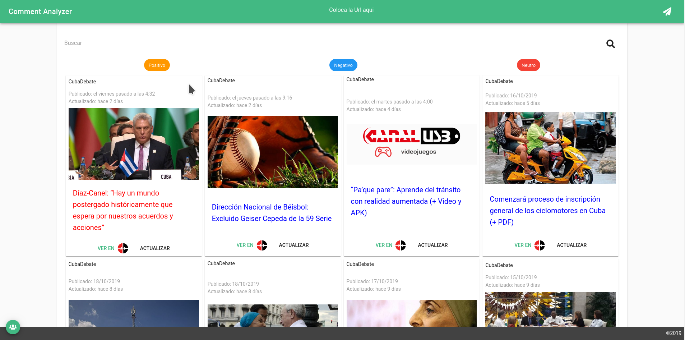
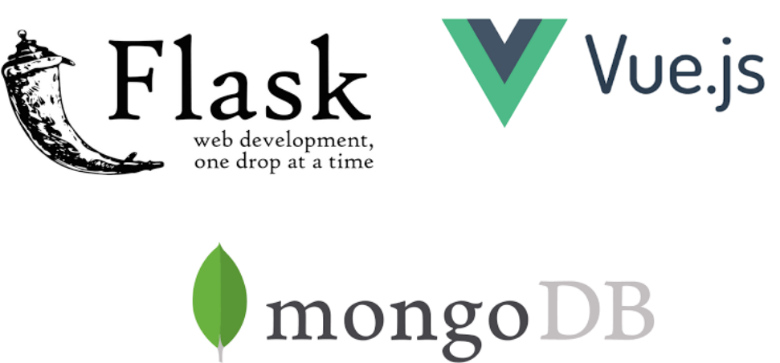
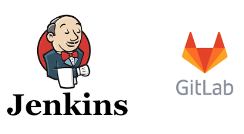
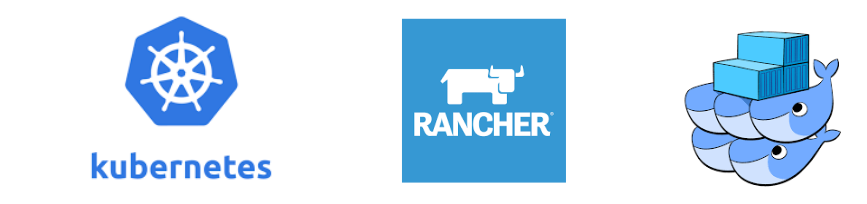

<h2>Arquitectura de Software para la Nube

</h2>

Autor:

<small>
Lic. Hian Cañizares Díaz /
<a href="mailto:hian.canizares@matcom.uh.cu">hian.canizares</a>

</small>

-----

### Conozcan a Commentlyzer

<a href="http://commentlyzer.uh.cu">http://commentlyzer.uh.cu</a>

-----

### Commentlyzer

-----

### 12 Factores

-----

### Factores ya cumplidos

* [I. Código base (Codebase)](http://12factor.net/es/backing-services)
* [II. Dependencias](http://12factor.net/es/backing-services)
* [V. Construir, desplegar, ejecutar](http://12factor.net/es/backing-services)
* [XII. Administración de procesos](http://12factor.net/es/backing-services)

-----

### No son responsabilidad de los programadores los servicios externos 

[(IV. Backing services)](http://12factor.net/es/backing-services)

* Bases de datos
* Ficheros
* Autenticación

-----

### Conversión a Microservicios
- Sin estado
- Declarar las dependencias entre los microservicios

-----

### Production vs Stage 

[(X. Paridad en desarrollo y producción)](http://12factor.net/es/backing-services)

* Desde el día 1

-----

### Continuos Delivery and Deployment

[Jenkins](https://jenkins.io) y [Gitlab](https://gitlab.com)

-----

### Fin ?

-----

### Construir Nueva infrestuctura de software para lograrlo

[Kubernetes](https://kubernetes.io/),  [RancherOS](https://rancher.com/) y [Swarm](https://docs.docker.com/engine/swarm/)

-----

### Construir Nueva infrestuctura de software para lograrlo

* Disminuir el uso de soluciones de virtualización por soluciones de Orquestación
* Crear clusters especializados por institución en brindar soporte de Bases de Datos, Almacenamiento y otros servicios comunes

-----

### Pasar a utilizar Plataforma como servicio
[Flynn.io](https://flynn.io)

-----

## Gracias

-----

# ¿Preguntas?

-----

<h2>Arquitectura de Software para la Nube

</h2>

Autor:

<small>
Lic. Hian Cañizares Díaz /
<a href="mailto:hian.canizares@matcom.uh.cu">hian.canizares</a>

</small>

